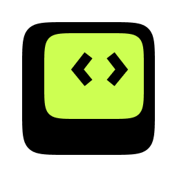

<p align="center">
  
</p>

# karmaIQ — Production Intelligence for Claude Code

> Coding tools see your code. **karmaIQ shows what that code does in production.**

karmaIQ brings real-time service-mesh truth — error rates, latency, dependencies, root cause — directly into your Claude Code session. It closes the gap between the file in front of you and the system actually running in prod.

This repository is the **karmaIQ plugin marketplace**: a set of composable Claude Code plugins, each targeting a specific production-intelligence workflow.

### What makes it different

- **Live production signal**, not static analysis — QPM, error %, p99 latency, amplification per edge, real callers
- **Autonomous SRE subagents** — incident, impact, architecture, and canary workflows run in isolated context, returning focused summaries instead of flooding your chat
- **Path-scoped + event-driven** — pre-warms on API mentions, hints blast radius on `git commit`, surfaces canary verdicts before promotion
- **Read-only by design** — every subagent restricted to karmaIQ MCP tools. No Bash, Edit, or shell access. Safe to install.

---

## Install

Inside Claude Code:

```
/plugin marketplace add codekarma-tech/codekarma-mcp-plugin
/plugins
```

Then install the plugins you need (see persona matrix below).

---

## Plugins

| Plugin | For | What it does |
|---|---|---|
| `karmaiq-core` | Everyone (install first) | MCP connection, domain picker, mesh exploration skill |
| `karmaiq-firefighter` | On-call SRE | Autonomous incident diagnosis. Pre-warms service lookups on user prompts |
| `karmaiq-impact` | Devs pre-commit | Blast-radius check before changing methods. Hints from staged diff on commit |
| `karmaiq-architect` | Architects | Cycles, SPOFs, dead code, hot methods, fan analysis |
| `karmaiq-promotion-gate` | CI/CD | Canary regression verdict — STABLE / WATCH / REGRESSION / INSUFFICIENT_DATA |

## Install by persona

```
# SRE / on-call
/plugin install karmaiq-core@karmaiq
/plugin install karmaiq-firefighter@karmaiq

# Dev (pre-commit safety)
/plugin install karmaiq-core@karmaiq
/plugin install karmaiq-impact@karmaiq

# Architect (structural review)
/plugin install karmaiq-core@karmaiq
/plugin install karmaiq-architect@karmaiq

# CI/CD (canary gate)
/plugin install karmaiq-core@karmaiq
/plugin install karmaiq-promotion-gate@karmaiq
```

After installing `karmaiq-core`, run `/karmaiq-core:setup` to pick your active CodeKarma domain (cached across sessions).

---

## Command cheatsheet

| Command | Plugin | What |
|---|---|---|
| `/karmaiq-core:setup` | core | Pick active CodeKarma domain (one-time) |
| `/karmaiq-core:overview` | core | Snapshot active domain — top services, top errors |
| `/karmaiq-core:domain [name]` | core | Show or switch active domain |
| `/karmaiq-firefighter:fire <api>` | firefighter | End-to-end RCA on a failing API |
| `/karmaiq-firefighter:rca <id>` | firefighter | Upstream root-cause walk |
| `/karmaiq-firefighter:errors` | firefighter | Top error-rate interfaces right now |
| `/karmaiq-impact:method <svc> <method>` | impact | Blast radius of changing one method |
| `/karmaiq-impact:service <svc>` | impact | What breaks if this service goes down |
| `/karmaiq-impact:path <from> <to>` | impact | All paths between two services |
| `/karmaiq-architect:cycles` | architect | Circular dependencies in the mesh |
| `/karmaiq-architect:spof` | architect | Single points of failure |
| `/karmaiq-architect:deadcode <svc>` | architect | Methods Nexus marked inactive |
| `/karmaiq-architect:hot <svc>` | architect | Top CPU-consuming methods |
| `/karmaiq-architect:fan [in\|out]` | architect | Most-depended-on / most-fanning-out |
| `/karmaiq-promotion-gate:canary <svc>` | promotion-gate | Canary regression verdict |
| `/karmaiq-promotion-gate:diff <a> <b>` | promotion-gate | Cross-entity regression diff |

Many flows trigger automatically from natural-language prompts too — see [EXAMPLES.md](EXAMPLES.md) for the full journey.

---

## First steps after install

See **[EXAMPLES.md](EXAMPLES.md)** for a guided user journey — copy-pasteable prompts with expected outputs, walking you through:

- **5-minute first-boot tour** — pick domain, snapshot the mesh, test the pre-warm hook
- **Journey 1 — SRE on-call**: incident lands at 2 AM, firefighter subagent runs end-to-end RCA
- **Journey 2 — Dev refactor safety**: "is this method safe to delete?", pre-commit impact warnings
- **Journey 3 — Architect quarterly review**: full-domain risk register via the architect subagent
- **Journey 4 — CI/CD canary gating**: STABLE / WATCH / REGRESSION / INSUFFICIENT_DATA verdicts
- **Crossover workflows** + a pattern cheat sheet

---

## Skip permission prompts for karmaIQ tools

karmaIQ is read-only — every tool is safe to auto-allow. Skills already pre-approve karmaIQ tools while active. For a global allowlist (covers inline use outside any skill), add to `~/.claude/settings.json` or your project's `.claude/settings.json`:

```json
{
  "permissions": {
    "allow": [
      "mcp__karma-iq__*"
    ]
  }
}
```

See [karmaiq-core README](plugins/karmaiq-core/README.md#skip-permission-prompts-for-karmaiq-tools) for the full breakdown including plugin-shipped defaults.

---

## Bring-Your-Own-Cloud (BYOC) karmaIQ instance

By default the plugins connect to the shared SaaS endpoint at `https://app.codekarma.tech/mcp` (streamable HTTP). If your organization runs a dedicated karmaIQ deployment on your own infrastructure, override the endpoint with the `KARMAIQ_MCP_URL` environment variable **before** launching Claude Code:

```bash
export KARMAIQ_MCP_URL=https://<your-byoc-domain>/mcp
claude
```

Or persist for the project — drop into `.envrc` (direnv), shell rc, or CC `settings.json`:

```json
{
  "env": {
    "KARMAIQ_MCP_URL": "https://<your-byoc-domain>/mcp"
  }
}
```

The `karmaiq-core` plugin's `.mcp.json` reads `${KARMAIQ_MCP_URL:-https://app.codekarma.tech/mcp}` — env var wins if set, default otherwise. The `SessionStart` hook surfaces the active URL when it's a custom value so you can see which instance you're hitting.

---

## How it works

Each plugin in this marketplace connects to the same remote karmaIQ MCP server (default: `https://app.codekarma.tech/mcp`, override per customer via `KARMAIQ_MCP_URL`) via streamable HTTP. The MCP server is hosted by CodeKarma; authentication is OAuth on first connect. The plugins themselves are configuration-only — they bundle:

- **Skills** that activate when Claude encounters relevant tasks (e.g. "API X is failing" → firefighting workflow)
- **Subagents** that run multi-step investigations in isolated context, returning focused summaries
- **Hooks** that pre-warm service lookups or run impact checks at the right lifecycle moments
- **Slash commands** for direct, deliberate invocation

The MCP server auto-injects its full operating manual at handshake; the plugins layer persona-specific workflows on top.

---

## Other channels

| Channel | How |
|---|---|
| **Cursor** | This repo also ships `.cursor-mcp.json` for direct Cursor configuration. See [Cursor section](#cursor) below. |
| **Claude.ai / Desktop / Mobile** | karmaIQ is in the Anthropic Connectors Directory. Search "karmaIQ" or "CodeKarma" in Settings → Connectors. |

### Cursor

Open Cursor → Settings → MCP → add:

```json
{
  "mcpServers": {
    "karma-iq": {
      "url": "https://app.codekarma.tech/mcp/sse"
    }
  }
}
```

OAuth on first use. The Cursor flow does not use the plugin/skill/hook layer — tools are exposed directly.

---

## Local development (pre-publish testing)

Test plugins locally without going through the marketplace install path:

```bash
claude --plugin-dir ./plugins/karmaiq-core \
       --plugin-dir ./plugins/karmaiq-firefighter \
       --plugin-dir ./plugins/karmaiq-impact \
       --plugin-dir ./plugins/karmaiq-architect \
       --plugin-dir ./plugins/karmaiq-promotion-gate
```

Inside the session: run `/reload-plugins` after any edit; run `/mcp` to verify the karmaIQ MCP server is connected. If `--plugin-dir` loaded plugins don't auto-trigger OAuth, run `/plugins` once to enable them.

See [AGENTS.md](AGENTS.md) for contributor rules — skill authoring, subagent rules, hook conventions, no-secrets policy.

---

## Requirements

- Active CodeKarma account with Karma Insights access
- Claude Code v2.1+ installed (`claude --version`)
- Your org admin must have granted you access to at least one domain

## License

MIT — see [LICENSE](LICENSE).

## Links

- [CodeKarma](https://codekarma.ai)
- [Plugin repository](https://github.com/codekarma-tech/codekarma-mcp-plugin)
- Contact: [info@codekarma.ai](mailto:info@codekarma.ai)
